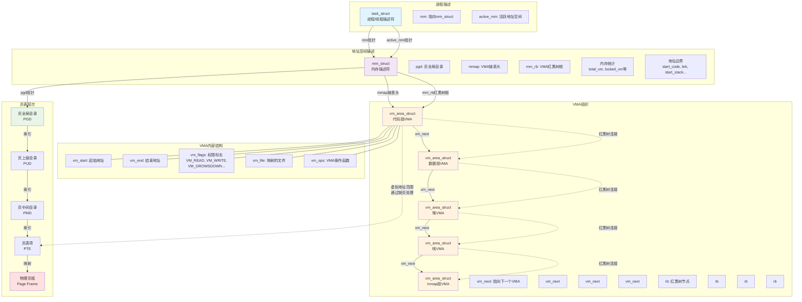

# `mm_struct` 结构与代码路径说明（基于本机 Linux 源码）

> 核对源码目录：`/Users/weli/works/linux`
> 目标：把“结构体定义 + 技术说明 + 代码路径 + 版本差异”按统一阅读顺序整合在一篇文档里。

---

## 1. 先建立整体认知：`mm_struct` 是什么

`mm_struct` 是 Linux 内核里描述**一个用户态虚拟地址空间**的核心对象。可以把它理解为“进程地址空间的总账本”，负责记录：

- 这段地址空间有哪些 VMA（虚拟内存区）
- 代码段/数据段/堆/栈等边界在哪里
- 页表根（`pgd`）在哪
- 这份地址空间当前被多少任务或内核路径引用（`mm_users` / `mm_count`）
- 地址空间统计信息（`total_vm`、`stack_vm` 等）

> 关键关系：`mm_struct`（全局描述） + `vm_area_struct`（分段描述） + 页表（地址翻译）共同构成进程虚拟内存视图。

---

## 2. 结构体定义在哪里（先看“定义”，再看“行为”）

### 2.1 `struct mm_struct`

- **定义文件**：`include/linux/mm_types.h`
- 当前源码中可直接看到的关键字段（节选）：
  - VMA 组织：`struct maple_tree mm_mt`
  - 地址布局：`mmap_base`、`mmap_legacy_base`、`task_size`
  - 页表根：`pgd_t *pgd`
  - 引用计数：`atomic_t mm_users`、`atomic_t mm_count`
  - 并发控制：`spinlock_t page_table_lock`、`struct rw_semaphore mmap_lock`
  - 内存统计：`total_vm`、`locked_vm`、`pinned_vm`、`data_vm`、`exec_vm`、`stack_vm`
  - 段边界：`start_code/end_code`、`start_data/end_data`、`start_brk/brk`、`start_stack`

### 2.2 `struct vm_area_struct`

- **定义文件**：`include/linux/mm_types.h`
- 关键字段（节选）：
  - `vm_start` / `vm_end`
  - `vm_mm`
  - `vm_page_prot`
  - `vm_flags`
  - `anon_vma` / `vm_ops`
  - `vm_pgoff` / `vm_file`

### 2.3 `struct task_struct` 与地址空间的关系

- **定义文件**：`include/linux/sched.h`
- 与地址空间最关键的两个字段：
  - `struct mm_struct *mm`
  - `struct mm_struct *active_mm`

含义简化：

- 普通用户进程：`mm` 与 `active_mm` 通常指向同一个地址空间
- 内核线程：`mm = NULL`，但会借用 `active_mm` 参与调度/切换流程

---

## 3. 从代码路径理解这些字段怎么工作

这一节把“结构体字段”与“内核行为函数”对应起来，方便从现象追到代码。

### 3.1 创建/复制地址空间：`copy_mm()`

- **实现文件**：`kernel/fork.c`
- 关键逻辑：
  - `clone_flags & CLONE_VM`：调用 `mmget(oldmm)`，共享同一个地址空间
  - 否则：调用 `dup_mm()`，复制一份新地址空间
  - 然后设置 `tsk->mm` 和 `tsk->active_mm`

这对应了线程共享地址空间与进程复制地址空间两条分支。

### 3.2 上下文切换地址空间：`switch_mm()` / `switch_mm_irqs_off()`

- **x86 实现文件**：`arch/x86/mm/tlb.c`
- `switch_mm()` 最终进入 `switch_mm_irqs_off()`，执行与页表上下文、TLB 相关的切换逻辑。
- 文档层面常说“切换时加载新页表根到 CR3”，在 x86 上是这一代码路径里的核心行为之一。

### 3.3 生命周期与引用计数接口：`mmget/mmput/mmgrab/mmdrop`

- **声明/内联实现文件**：`include/linux/sched/mm.h`
- 语义分工：
  - `mm_users`：地址空间“使用者”计数（用户态语义更强）
  - `mm_count`：对象本体引用计数（决定 `mm_struct` 何时释放）

### 3.4 退出回收地址空间：`exit_mmap()`

- **实现文件**：`mm/mmap.c`（MMU）或 `mm/nommu.c`（NOMMU）
- 在 mm 生命周期结束阶段，负责撤销 VMA 和页表等资源。

---

## 4. 结合当前内核版本，哪些“经典说法”要更新

你原始说明总体方向正确，但有几处属于旧口径，建议在当前源码上更新。

### 4.1 VMA 组织方式

- 旧口径：`mmap` 链表 + `mm_rb` 红黑树
- 当前源码：`mm_struct` 中是 **`mm_mt`（Maple Tree）**

### 4.2 锁字段命名

- 旧口径：`mmap_sem`
- 当前源码：**`mmap_lock`**

### 4.3 字段类型

- 旧口径：`unsigned long pinned_vm`
- 当前源码：**`atomic64_t pinned_vm`**

其余你文中提到的核心边界字段（`start_code`、`brk`、`start_stack` 等）和引用计数语义仍然可沿用。

---

## 5. 推荐阅读顺序（从入门到源码）

1. 先读本篇第 1、2 节（知道“对象是什么 + 在哪定义”）
2. 再读第 3 节（把字段和行为函数建立映射）
3. 最后读第 4 节（避免把旧版本描述带进当前内核）

如果需要继续下钻，建议按路径打开源码：

- `include/linux/mm_types.h`
- `include/linux/sched.h`
- `kernel/fork.c`
- `arch/x86/mm/tlb.c`
- `include/linux/sched/mm.h`
- `mm/mmap.c`

---

## 6. 一句话结论

在你当前 `/Users/weli/works/linux` 这版源码上，`mm_struct` 仍是进程地址空间的顶层结构；
需要特别注意与旧资料的差异是：**VMA 主组织改为 `mm_mt`、锁名是 `mmap_lock`、`pinned_vm` 为 `atomic64_t`**。

---

以下Mermaid图展示了`task_struct`、`mm_struct`、`vm_area_struct`以及页表之间的关系：

## 结构关系说明

### 1. **进程级关系**
- 每个`task_struct`（进程/线程）通过`mm`指针指向其地址空间描述符
- 多个线程可以共享同一个`mm_struct`（`CLONE_VM`标志）
- 内核线程的`mm`为`NULL`，借用其他进程的`active_mm`

### 2. **地址空间级关系**
- `mm_struct`通过两种方式组织VMA：
  - `mmap`：链表，便于顺序遍历（如`/proc/pid/maps`）
  - `mm_rb`：红黑树，便于快速按地址查找VMA
- `pgd`指向该进程的页表根，实现虚拟地址到物理地址的转换

### 3. **VMA级关系**
- 每个VMA描述一段连续的虚拟地址区间
- 通过`vm_next`形成链表
- 通过`rb`节点挂载到红黑树
- 包含该区域的起始/结束地址、权限、文件映射等信息

### 4. **页表级关系**
- 四级页表结构（x86-64）：PGD → PUD → PMD → PTE
- 页表项指向物理页框
- VMA定义了虚拟地址的语义，页表实现实际映射
- 缺页异常时，内核根据VMA的权限和类型建立页表映射

### 5. **关键数据流**
- **地址查找**：给定虚拟地址 → 红黑树查找VMA → 验证权限 → 页表walk → 物理地址
- **内存映射**：`mmap`系统调用 → 创建VMA → 插入红黑树和链表 → 更新`mm_struct`统计
- **缺页处理**：触发异常 → 查找VMA → 分配物理页 → 建立页表映射

这个层次结构清晰地体现了Linux虚拟内存管理的分层设计：**进程 → 地址空间 → VMA → 页表 → 物理内存**，每一层都有明确的职责划分。